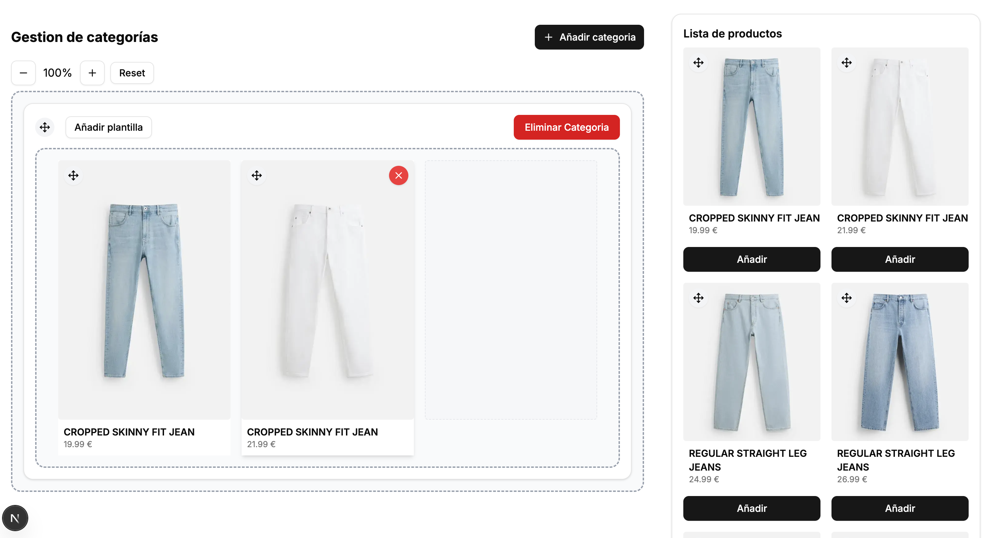

# Inditex Category Management
A beautiful, modern category and product management interface for Inditex, featuring drag-and-drop, template assignment, and responsive design. Built for speed and usability.

[Live Demo](https://gestion-de-categorias.vercel.app/)




## Features

- 🛒 Category & Product Management
- 🖱️ Drag and Drop for Products & Categories
- ➕ Add/Remove Products and Categories
- 🗂️ Assign Templates (Left, Center, Right Alignment)
- 🔍 Zoom Controls for Editor Area
- 🖼️ Product Images & Details Always Visible
- 📦 Demo Data with Realistic Images
- ⚡ Fast, Modern UI with Tailwind CSS

## Tech Stack

- **Framework:** Next.js 14
- **Language:** TypeScript
- **Styling:** Tailwind CSS
- **Database:** (Demo/Fake Data)
- **UI Components:** Shadcn UI
- **Icons:** Lucide React
- **Code Formatter/Linter:** Biome


## Requirements

- [x] At all times, the photo, name, and price of each product must be visible.
- [x] You can add new products or remove existing ones.
- [x] You can create as many rows (categories) as you want.
- [x] Rows must have between 1 and 3 elements.
- [x] You must be able to add elements to rows and swap them between different rows or within the same row using Drag and Drop.
- [x] Rows can be reordered.
- [x] You can zoom in and out on the grid editor. If many rows are added, you may lose context of the category layout. The zoom helps you see as many rows as possible. This zoom should only affect the editor area, not the entire page, so you cannot use the browser's native zoom.
- [x] You can associate and disassociate a template to a row.
- [x] There are three templates available: left alignment, center alignment, and right alignment.
- [x] You can see the name of the template assigned to each row.
- [x] In addition to seeing the template name, you can preview the alignment effect in the editor. For example, if you select the right alignment template, products in that row will be right-aligned in the editor.

## Setup

1. **Install dependencies:**
   ```sh
   pnpm install
   # or
   npm install
   # or
   yarn install
   ```

2. **Run the development server:**
   ```sh
   pnpm dev
   # or
   npm run dev
   # or
   yarn dev
   ```

3. **Open your browser:**
   Visit [http://localhost:3000](http://localhost:3000) to use the app.

## Usage

- **Add a category:** Click the "Añadir categoria" button to create a new row (category).
- **Add a product:**
  - Use the "Añadir" button in the product list to add a product to the first category (row).
  - Each category can have a maximum of 3 products. When the limit is reached, the "Añadir" button is disabled for that product.
- **Remove a product:** Use the remove button on each product card within a category.
- **Reorder products:** Drag and drop products within a row or between rows.
- **Reorder categories:** Drag and drop entire rows to change their order.
- **Zoom:** Use the zoom controls to zoom in/out on the grid editor area.
- **Templates:**
  - Assign a template (left, center, right alignment) to a row using the template selector.
  - The alignment is visually reflected in the editor.
  - You can remove the template from a row at any time.

## Notes

- When adding products using the "Añadir" button, products are always added to the first category (row). If the first category is full (3 products), the button is disabled until a slot is available.
- All product data is demo/fake data and images are stored in the `public/images` directory.

---
